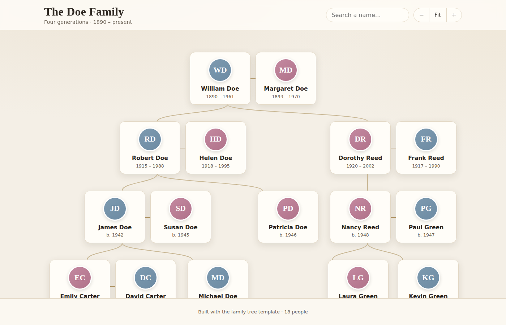

# Family Tree Website

A visually appealing, interactive family tree you can host for free. It's a
plain static website — no build tools, no server, no database. Open it in a
browser and it just works.



## Features

- 📇 **Card-based tree** laid out by generation with connecting lines
- 🖼️ **Photos or auto-generated initials** for every person
- 🔍 **Search** to highlight and jump to any relative
- 🔎 **Zoom & drag-to-pan** for large families
- 👤 **Click a person** to see dates, birthplace and a short bio
- 📱 **Responsive** — works on phones, tablets and desktops

## The only file you edit: `js/family-data.js`

You don't need to touch any HTML, CSS or the renderer. Everything about *your*
family lives in **`js/family-data.js`**. Open it and replace the sample Doe
family with your own.

Each person is an object. A person can have a `spouse` and `children`, and each
child is just another person — so the structure nests as deep as your tree goes:

```js
const familyData = {
  name: "William Doe",
  born: "1890",
  died: "1961",
  gender: "m",                 // "m" or "f" — only tints the avatar color
  place: "Boston, Massachusetts",
  notes: "The patriarch who started the family farm.",
  spouse: { name: "Margaret Doe", born: "1893", died: "1970", gender: "f" },
  children: [
    {
      name: "Robert Doe",
      born: "1915",
      spouse: { name: "Helen Doe", born: "1918", gender: "f" },
      children: [ /* ...and so on... */ ]
    }
  ]
};
```

Only `name` is required — everything else is optional. Set the heading text at
the top of the same file:

```js
const FAMILY_TITLE = "The Smith Family";
const FAMILY_SUBTITLE = "Five generations · 1880 – present";
```

### Adding photos

1. Drop image files into the **`assets/`** folder (square images look best).
2. Reference them on a person: `photo: "assets/grandpa.jpg"`.

People without a photo automatically show their initials in a colored circle.

## Viewing it locally

Because browsers restrict `file://` pages, run a tiny local server from the
project folder:

```bash
# Python (already on most machines)
python3 -m http.server 8000
```

Then open <http://localhost:8000> in your browser. (Simply double-clicking
`index.html` also works in most browsers.)

## Publishing it for the family to see (free)

**GitHub Pages** is the easiest option:

1. Push this repository to GitHub.
2. Go to **Settings → Pages**.
3. Under *Build and deployment*, set **Source: Deploy from a branch**, pick your
   branch and the `/ (root)` folder, and **Save**.
4. After a minute your tree is live at
   `https://<your-username>.github.io/<repo-name>/`.

Other free hosts (Netlify, Cloudflare Pages, Vercel) also work — just point them
at this folder; there's nothing to build.

## Project layout

```
index.html            # page shell
css/styles.css        # all styling / theme colors
js/family-data.js     # ← YOUR family goes here
js/tree.js            # renderer (layout, lines, search, zoom) — no edits needed
assets/               # your photos
```

## Customizing the look

Colors and fonts are defined as CSS variables at the top of `css/styles.css`
(`--bg`, `--accent`, `--male`, `--female`, …). Change those to re-theme the
whole site in one place.
